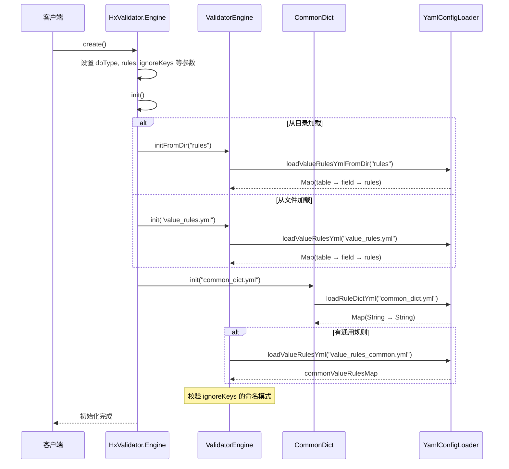
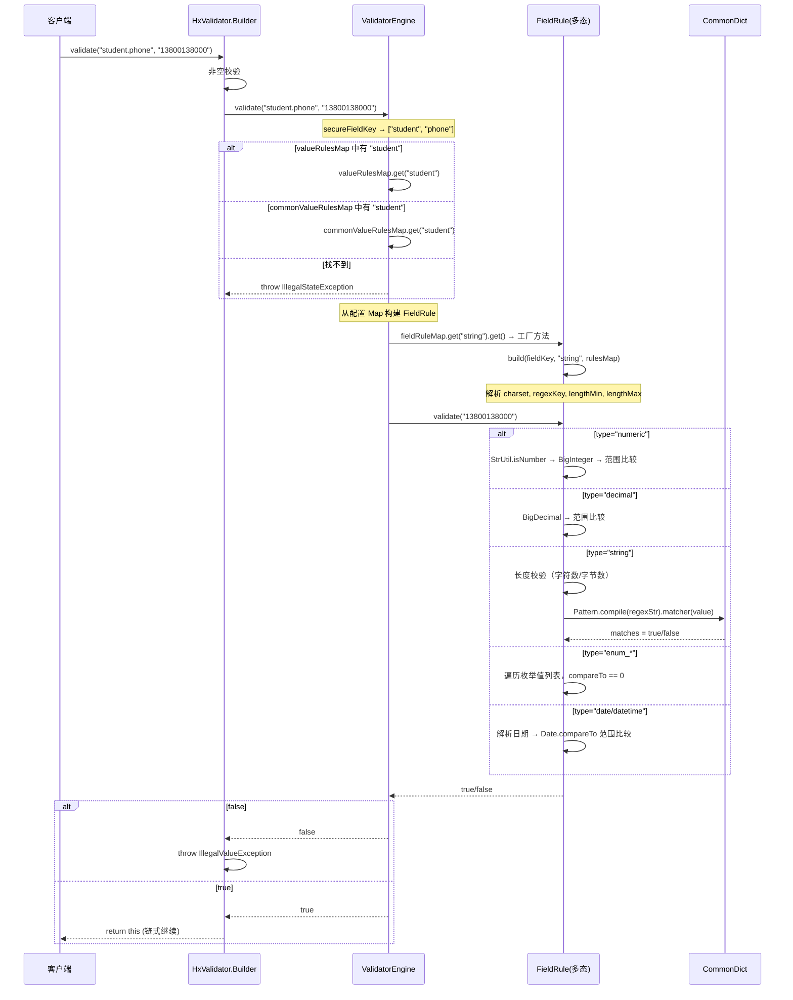
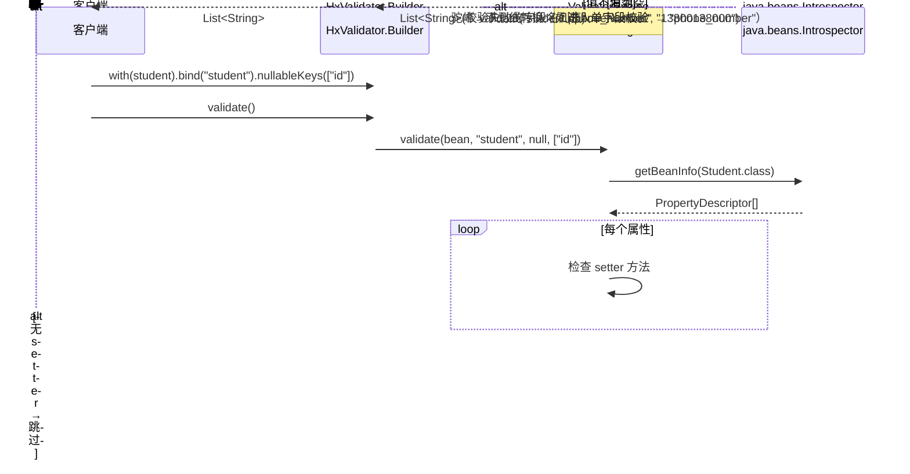
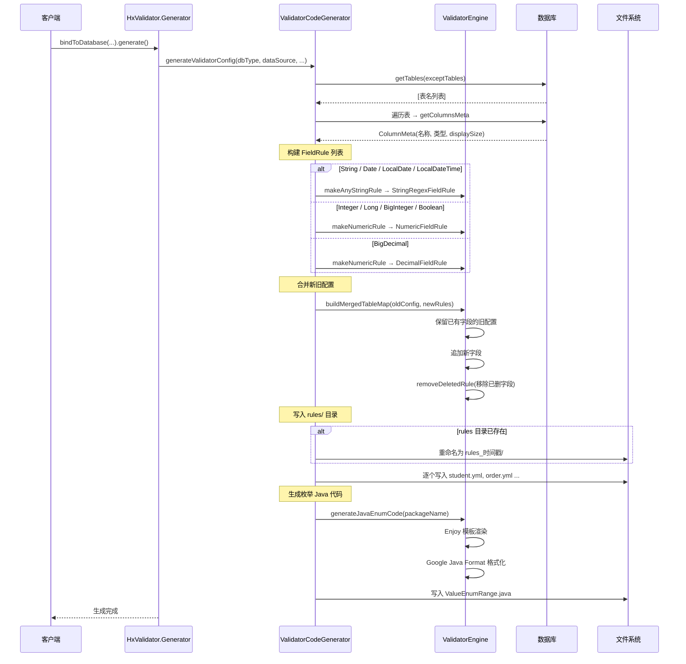
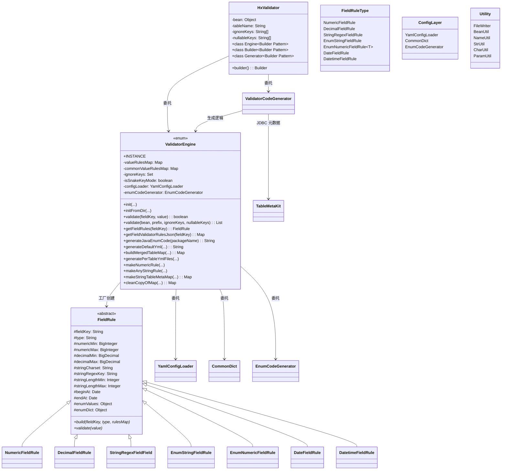

# bay-validator 设计文档

---

## 一、项目定位

基于 YAML 配置的校验引擎，核心价值是**将校验规则从代码中解耦**，使得：

- 后端（Java）和前端（JS）共享同一份校验规则
- 规则变更无需重新编译代码
- 支持从数据库表结构自动生成规则

---

## 二、核心架构

### 2.1 分层设计

```
┌─────────────────────────────────────────────────────────────────┐
│                     HxValidator (外观层)                         │
│  ┌──────────┐  ┌───────────┐  ┌──────────────┐                  │
│  │  Engine   │  │  Builder  │  │  Generator    │                  │
│  │  (初始化)  │  │  (校验)    │  │  (代码生成)    │                  │
│  └─────┬────┘  └─────┬─────┘  └──────┬───────┘                  │
└────────┼──────────────┼──────────────┼──────────────────────────┘
         │              │              │
         ▼              ▼              ▼
┌─────────────────────────────────────────────────────────────────┐
│                  ValidatorEngine (核心引擎)                       │
│  - 规则加载与缓存                                                │
│  - 规则查询与 FieldRule 构建                                      │
│  - 验证入口（单字段/Bean）                                        │
│  - 规则序列化（JSON 输出给前端）                                   │
│  - YML 合并生成                                                  │
└───────┬────────────────────┬──────────────────┬─────────────────┘
        │                    │                  │
        ▼                    ▼                  ▼
┌──────────────┐  ┌──────────────────┐  ┌──────────────────┐
│YamlConfigLoader│  │  FieldRule 体系   │  │  EnumCodeGenerator│
│(YAML 文件加载)  │  │  (8 种校验类型)   │  │  (枚举代码生成)    │
└──────────────┘  └──────────────────┘  └──────────────────┘
        │                    │
        ▼                    ▼
┌──────────────┐  ┌──────────────────┐
│  CommonDict  │  │  hxValidator.js  │
│ (正则词典)    │  │  (前端 JS 校验)   │
└──────────────┘  └──────────────────┘
```

### 2.2 核心类职责

| 类 | 类型 | 职责 |
|---|---|---|
| `ValidatorEngine` | 枚举单例 | 校验引擎核心，持有规则配置，提供校验入口 |
| `HxValidator` | 普通类 | 外观层，提供 Builder 模式的 Engine/Builder/Generator 三个内部类 |
| `YamlConfigLoader` | 普通类 | YAML 文件加载，支持 classpath 多 jar 合并和目录加载 |
| `CommonDict` | 枚举单例 | 正则词典缓存，存储 common_dict.yml 中的正则表达式 |
| `FieldRule` | 抽象类 | 校验规则的 OOP 抽象，8 个子类对应 8 种校验类型 |
| `EnumCodeGenerator` | 普通类 | 从配置生成 Java 枚举代码 |
| `FileWriter` | 工具类 | 文件写入，支持备份和覆盖 |
| `hxValidator.js` | JS 文件 | 前端校验实现，与后端 FieldRule 的校验逻辑一一对应 |

---

## 三、配置体系

### 3.1 配置架构

```
resources/
├── rules/                    # 校验规则目录（每表一个 yml 文件）
│   ├── student.yml           # student 表的校验规则
│   ├── order.yml             # order 表的校验规则
│   └── ...
├── common_dict.yml           # 公共正则词典
└── hxValidator.js            # 前端校验 JS 库
```

### 3.2 YAML 规则结构

```yaml
# resources/rules/student.yml
student:                        # ← 表名，也是校验 key 的前缀
  name:                         # ← 字段名
    type: string                #   校验类型
    string_charset: utf8        #   字符串编码（用于长度计算）
    string_regex_key: username  #   引用 common_dict.yml 中的正则键
    string_length_min: 2        #   最小长度
    string_length_max: 50       #   最大长度
  age:
    type: numeric
    numeric_min: 0
    numeric_max: 150
  gender:
    type: enum_string
    enum_values:
      - male
      - female
  money:
    type: decimal
    decimal_min: 0.00
    decimal_max: 999999.99
  birthday:
    type: date
    begin_at: 1900-01-01
    end_at: 2100-12-31
  created_at:
    type: datetime
    begin_at: 2020-01-01 00:00:00
```

### 3.3 8 种校验类型

| 类型 | Java 类 | JS 对应 | 校验逻辑 |
|------|---------|---------|---------|
| `numeric` | `NumericFieldRule` | `range__checker` | 转为 BigInteger，检查 `numericMin ≤ 值 ≤ numericMax` |
| `decimal` | `DecimalFieldRule` | `decimal_range__checker` | 转为 BigDecimal，检查 `decimalMin ≤ 值 ≤ decimalMax` |
| `string` | `StringRegexFieldRule` | `string_length__checker` + `regex__checker` | 先检查长度（字符/字节），再正则匹配 |
| `enum_string` | `EnumStringFieldRule` | `value_range__checker` | 检查字符串值是否在枚举列表中 |
| `enum_numeric` | `EnumNumericFieldRule<BigInteger>` | `value_range__checker` | 检查整数值是否在枚举列表中 |
| `enum_decimal` | `EnumNumericFieldRule<BigDecimal>` | `value_range__checker` | 检查浮点值是否在枚举列表中 |
| `date` | `DateFieldRule` | `date__checker` | 解析 yyyy-MM-dd，检查 `beginAt ≤ 值 < endAt` |
| `datetime` | `DatetimeFieldRule` | `date__checker` | 解析 yyyy-MM-dd HH:mm:ss，检查范围 |

### 3.4 `lengthMode` 设计

字符串字段的 `string_charset` 配置决定了前后端校验的长度计算模式：

```json
// 后端序列化给前端的 JSON 中包含 lengthMode 字段
{
  "type": "string",
  "stringLengthMin": 11,
  "stringLengthMax": 11,
  "stringCharset": "utf8",
  "regexStr": "^1[3-9]\\d{9}$",
  "lengthMode": "byte"   // 或 "char"
}
```

- **`"char"`** — charset 为空，按字符数校验（MySQL 方式）
- **`"byte"`** — charset 不为空，按字节数校验（Oracle 方式）

设计目标：**前端不需要知道后端的数据库类型**，只需要根据 `lengthMode` 选择计数方式。

### 3.5 两端一致性

| 场景 | Java 端 | JS 端 |
|------|---------|-------|
| 字符模式 | `value.length()` | `value.length` |
| 字节模式 (utf8) | `value.getBytes("utf8").length` | `TextEncoder.encode(value).length` 或逐字符映射 |
| 字节模式 (GBK) | `value.getBytes("GBK").length` | 逐字符映射表（非 CJK=1, CJK=2） |

---

## 四、核心流程

### 4.1 初始化流程



### 4.2 单字段校验流程



### 4.3 Bean 对象校验流程



### 4.4 代码生成流程



---

## 五、类关系图



---

## 六、前后端校验一致性

### 6.1 整体设计

```
    Java 端                          JS 端
    ┌─────────────┐               ┌──────────────┐
    │ FieldRule    │  JSON 序列化  │ hxValidator.js│
    │ 8 个子类     │ ──────────►  │ prototype 方法│
    │ validate()  │               │ validate()    │
    └─────────────┘               └──────────────┘
          │                              │
          │ 同一份 YAML 配置               │ 同一份 JSON 配置
          ▼                              ▼
    ┌─────────────┐               ┌──────────────┐
    │ value_rules │               │ API 返回规则  │
    │ .yml        │               │ JSON          │
    └─────────────┘               └──────────────┘
```

### 6.2 规则 JSON 序列化格式

后端通过 `getFieldValidatorRulesJson(fieldKey)` 将校验规则序列化为 JSON，其中：

- 所有 `null` 值被去除（`@JsonInclude(Include.NON_NULL)`)
- 字符串类型自动追加 `regexStr`（从 CommonDict 中取出正则表达式原文）
- 追加 `lengthMode` 字段（"char"/"byte"），指示前端使用字符数还是字节数

```json
// string 类型
{
  "type": "string",
  "stringCharset": "utf8",
  "stringLengthMin": 11,
  "stringLengthMax": 11,
  "stringRegexKey": "phone_number",
  "regexStr": "^1[3-9]\\d{9}$",
  "lengthMode": "byte"
}

// numeric 类型
{
  "type": "numeric",
  "numericMin": 1,
  "numericMax": 128
}

// enum_string 类型
{
  "type": "enum_string",
  "enumValues": ["male", "female"]
}

// date 类型
{
  "type": "date",
  "beginAt": "2020-01-01",
  "endAt": "2030-12-31"
}
```

### 6.3 校验规则对照表

| 字段类型 | Java 校验器 | JS 校验器 | 校验方式 |
|---------|------------|----------|---------|
| numeric | `NumericFieldRule.validate()` | `range__checker()` | `Number(value) >= min && <= max` |
| decimal | `DecimalFieldRule.validate()` | `decimal_range__checker()` | 同上（BigDecimal 侧重点不同） |
| string | `StringRegexFieldRule.validate()` | `string_length__checker()` + `regex__checker()` | 长度 + 正则 |
| enum_string | `EnumStringFieldRule.validate()` | `value_range__checker()` | 遍历枚举列表 |
| enum_numeric | `EnumNumericFieldRule<BigInteger>.validate()` | `value_range__checker()` | 类型匹配 + 遍历 |
| enum_decimal | `EnumNumericFieldRule<BigDecimal>.validate()` | `value_range__checker()` | 字符串比较 |
| date | `DateFieldRule.validate()` | `date__checker()` | `beginAt ≤ value < endAt` |
| datetime | `DatetimeFieldRule.validate()` | `date__checker()` | 同上（包含时分秒） |

---

## 七、数据库表自动生成规则

### 7.1 字段类型映射

| 数据库列类型 | JDBC className | 生成的校验类型 | 校验规则 |
|------------|----------------|--------------|---------|
| VARCHAR / CHAR / TEXT | `java.lang.String` | `string` | `any_string` 正则, length 1～displaySize |
| INT / TINYINT / SMALLINT | `java.lang.Integer` | `numeric` | min=0, max=Long.MAX_VALUE |
| BIGINT | `java.lang.Long` | `numeric` | min=0, max=Long.MAX_VALUE |
| BIGINT UNSIGNED | `java.math.BigInteger` | `numeric` | min=0, max=Long.MAX_VALUE |
| DECIMAL | `java.math.BigDecimal` | `decimal` | min=0.00, max=Long.MAX_VALUE |
| BIT(1) / TINYINT(1) | `java.lang.Boolean` | `numeric` | min=0, max=Long.MAX_VALUE |
| DATE | `java.sql.Date` → `java.util.Date` | `string` | 按字符串处理 |
| TIMESTAMP / DATETIME | `java.sql.Timestamp` → `java.util.Date` | `string` | 按字符串处理 |

### 7.2 合并生成的规则

每次重新生成时：

1. 读取旧配置（`value_rules.yml` 或 `rules/` 目录）
2. 从数据库读取当前表结构
3. **已有字段保留旧配置**（不覆盖手工修改）
4. **新增字段追加默认配置**
5. **已删除字段自动移除**
6. 生成前，旧的 `rules/` 目录重命名为 `rules_时间戳/` 作为备份

---

## 八、设计决策说明

### 8.1 为什么用枚举单例？

`ValidatorEngine` 和 `CommonDict` 都采用枚举单例模式：
- 校验规则在应用生命周期内只需加载一次
- 枚举单例天然线程安全（JVM 保证）
- 避免重复创建和配置的 overhead

### 8.2 为什么用抽象工厂创建 FieldRule？

```java
private static Map<String, Supplier<FieldRule>> fieldRuleMap = new HashMap<>();
static {
    fieldRuleMap.put("numeric", () -> new NumericFieldRule());
    fieldRuleMap.put("decimal", () -> new DecimalFieldRule());
    // ...
}
```

每次 `validate()` 调用都创建新的 `FieldRule` 实例，避免并发场景下 SimpleDateFormat 等非线程安全成员的竞态。

### 8.3 为什么按表名分文件？

- 大型项目中表可能有几十到上百张，单文件过大不易维护
- Git diff 更清晰（修改 student.yml 不会影响 order.yml 的 diff）
- 支持模块化配置（不同表由不同团队维护）
- 目录备份粒度更细

### 8.4 为什么前端 JS 不依赖第三方库？

- 将外部依赖降到最低，开箱即用
- JS 校验逻辑与后端完全对应，无框架耦合
- 可在任何前端框架中使用（React / Vue / 原生）
